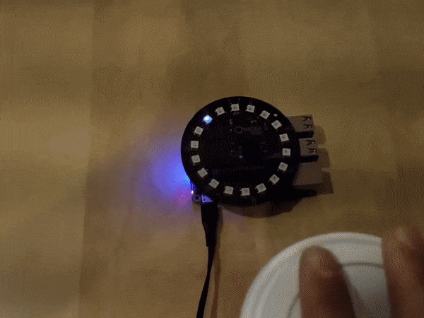

# Running ODAS using a MATRIX Creator/Voice board

## Install Matrix Software

```batch
# Add repo and key
curl https://apt.matrix.one/doc/apt-key.gpg | sudo apt-key add -
echo "deb https://apt.matrix.one/raspbian $(lsb_release -sc) main" | sudo tee /etc/apt/sources.list.d/matrixlabs.list

# Update packages and install
sudo apt-get update
sudo apt-get upgrade

# Installation
sudo apt install matrixio-creator-init
sudo apt install libmatrixio-creator-hal
sudo apt install libmatrixio-creator-hal-dev
sudo reboot

```

After reboot, install the MATRIX Kernel Modules as follows:

```batch
sudo apt install matrixio-kernel-modules
sudo reboot
```

## Install ODAS Prerequisites

You will need CMake, GCC and the following external libraries:

```batch
sudo apt-get install g++ git cmake
sudo apt-get install libfftw3-dev
sudo apt-get install libconfig-dev
sudo apt-get install libasound2-dev
sudo apt install libjson-c-dev
```

## Installing ODAS

Clone the ODAS project:

```batch
git clone https://github.com/introlab/odas.git
```

Create a folder to build the project and build it:

```batch
cd odas
mkdir build
cd build
cmake ..
make
```

## Run the demo!

You need to run two applications. The `odaslive` that performs all the cool audio processing and the `matrix-odas` that receives the result and draws it in the MATRIX Everloop.

```batch
cd ~/odas/bin
./matrix-odas &
./odaslive -vc ../config/matrix-demo/matrix_voice.cfg
```

Make some noise! ... you should see a blue lights indicating where the sound is coming from.


